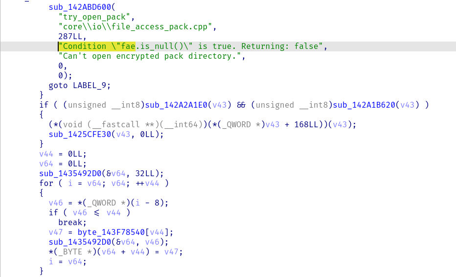
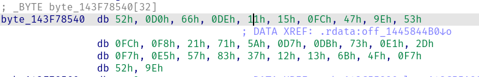
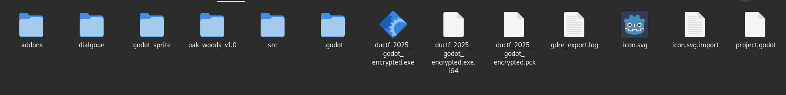
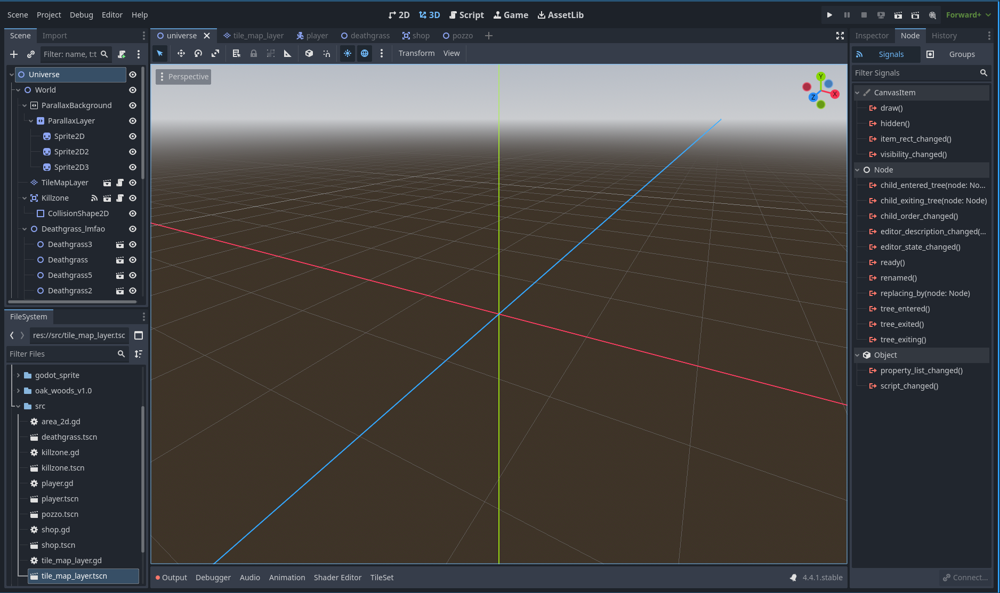
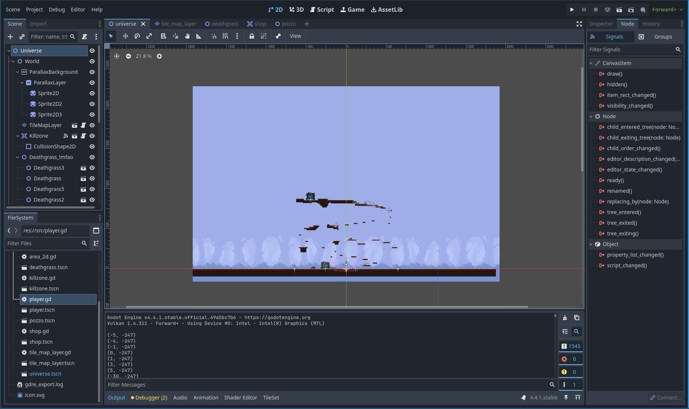
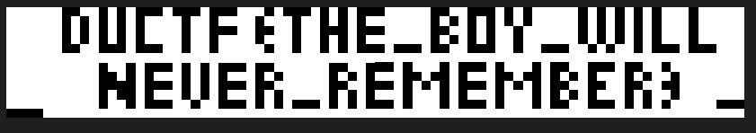

# Godot (Rev, 180 points)

> Vladimir and Estragon converse on various topics while they wait for a man named Godot. While they wait, Pozzo is on his way to the market to sell his slave, Lucky.
>
> Regards,
> jzt

FLAG = DUCTF{THE_BOY_WILL_NEVER_REMEMBER}


## Background

This challenge was a medium difficulty reverse engineering challenge for the DownUnder 2025 CTF. The goal was to get the flag from a game created in the Godot game engine. If you are not familiar with how to reverse engineer a game written in Godot I will try to explain as best as I can. The way I solved it is completely different then the official writeup created by the author of the challenge. I will say I think this challenge should have been in the beginner or easy category because it really was an easy challenge.

## Tools You Will Need to Decompile Any Godot Game
Here is a list of tools you will need to extract Godot game files.

- A decompiler.
- GDRETools - [https://github.com/GDRETools/gdsdecomp](https://github.com/GDRETools/gdsdecomp)
- Godot game engine to run the game with modified game scripts.

## How to Extract Godot Game Files

In order to extract game files from a game created in Godot you need to first download the game and then find the encryption key. You can find the encryption key by opening the game in your preffered decompiler, it will take a bit for it to decompile the entire binary since the entire binary is just the Godot game engine. Once it's done you can search for a string that says "Can't open encrypted pack directory." or "Condition \"fae" the former is easier to find. Once you find where that string is used in the code you will find something that looks similar to this 

 

depending on the decompiler you use it might look a little different but there will be an array that gets looped over. That array is the encryption key you can double click on the array and it will take you to where it is stored in the binary. Here is what it looks like for this game 



Once you have the encryption key you can open up GDRETools and then Click on RE Tools > Set encryption key and copy the encryption key you found into the text box. Click ok and then Click on RE Tools > Recover Project and select the executable file or if it comes with a .pck file you can use that as well. If the encryption key is correct you should be able to see all of the game files in the folder you saved them too. It should look something like this 



You can now open it in Godot, when it is down loading the project you should be greeted with a screen that looks like this 



## Analyzing Game Files 

Now that you loaded the godot project you can start looking at all the different game files and even run the game in the editor to play it and see different debug messages. I will typically look for a player script and run the game, while I adjust some player values to make them faster or jump higher so I can get over different barriers, raise health or disable deaths. In this challenge none of that mattered as much, because If you look at the log messages when running the debug build of the game you can see that it prints out something that looks to be coordinates. So now is the time to see if we can Find a map file that shows the entire map, in this case it happens to be called world and looks like this 



If you zoom out just a little you will see text that says DUCTF outside of the map at the top. If you click on the TileMapLayer entity you can see coordinates on the bottom left of the map viewport and if you read them carefully with the debug messages you will see that their pixels line up perfectly. So how can we find out where the debug messages are coming from well you can search for one of the coordinates that got printed and it will lead you to a file called tile_map_layer.gd which is where all of the coordinates are. That lead me to believe that those could be displayed by some condition that the player encounters, which could display the flag. I was too lazy to look for that condition so I copied and pasted that entire array into a python script and created a simple class that was a basic vector2i just for the coordinates. that class looks like 

```python 

class Vector2i:
    def __init__(self, x, y):
        self.x = x
        self.y = y
```
## Solving and Displaying the Coordinates

With the Vector2i class and coordinates in the script it was time to generate an image that would display whatever those coordinates produced. Using the PIL python library I created this code 

```python

all_points = list(coords)

min_x = min(p.x for p in all_points)
max_x = max(p.x for p in all_points)
min_y = min(p.y for p in all_points)
max_y = max(p.y for p in all_points)

scale = 3
image_width = (max_x - min_x + 1) * scale
image_height = (max_y - min_y + 1) * scale

image = Image.new('RGB', (image_width, image_height), color = 'white')
draw = ImageDraw.Draw(image)

main_point_color = (0, 0, 0)

def world_to_image_coords(vec: Vector2i) -> tuple[int, int]:
    img_x = (vec.x - min_x) * scale
    img_y = (vec.y - min_y) * scale
    return img_x, img_y

for p in coords:
    img_x, img_y = world_to_image_coords(p)
    draw.rectangle([img_x, img_y, img_x + scale - 1, img_y + scale - 1], fill=main_point_color)

output_filename = "tile_map_output.png"
image.save(output_filename)
print("generated image")
```

All it does is get the minimum and maximum x and y coordinates, turn the game coordinates into image coordinates, loop through the coordinates and draw them onto an image, it finally saves the image to a file. When we open the file in any app that can display images we are greeted with this image



Looking at the image you can see the DUCTF flag structure so we can submit the flag to the challenge submission box and get the points for solving the challenge.

## Epilogue

Yes this story is not completely finished, after the CTF ended I saw the authors released their solution writeups and the challenge seemed to be even easier than what I came up with. Turns out the player script actually could have given you the flag if you changed a boolean variable named "lucky" and a boolean variable named "godot" to true It would spawned an entity named Godot and it would have gave you the flag. When I tried doing that it didn't seem to work, maybe I didn't have the latest version of GDRETools that could extract the full dialogue because it did end up complaining about dialogue files but yeah the challenge was definitely way easier than I thought. 