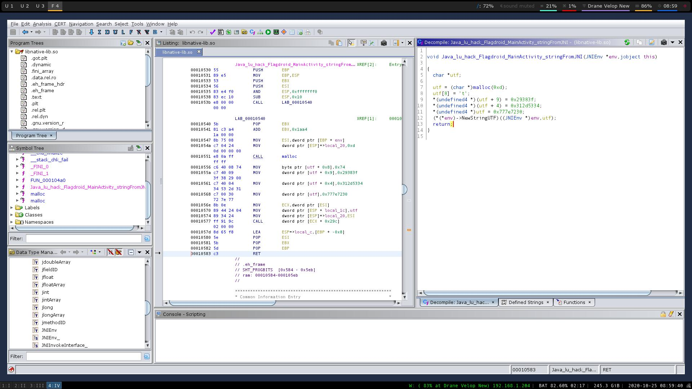

# flagdroid (Rev, 153 points)

> This app won't let me in without a secret message. Can you do me a favor and find out what it is?

FLAG = flag{tH4T_w45N-T~so_h4rd~huh_0r~w4S-1t?8)}

This challenge is an android reversing challenge. It was one of the easier challenges during the Hacklu 2020 CTF. 

The first step I took to reversing this android application was unzipping the apk file. 

```bash
unzip flagdroid.apk -d flagdroidapk
```

The reason you can do that is because an apk file is just a regular zip file. After it finished extracting all the files I used dex2jar to turn the .dex file into a .jar file. I then used jd-gui to open the jar file and just clicked file save sources.

I then got to work reversing the java program. The first thing I noticed was 
```java
static {
    System.loadLibrary("native");
}
```
That loads in a dynamic library. Its pretty standard for android apps if they use c++ or c. So I opened up ghidra and took the file from "lib/x86_64". I know that when using a native library there is usually a function called "Java_" then what ever the function name is called. When I took a look at I noticed a call to NewStringUTF. From looking at the documentation online the function creates a new String object from an array of characters in modified UTF-8 encoding. The parameters the function needs is a "JNIEnv*" and a "const char*". 
 


So with that information I knew that the local variable was a char*. (I don't know if other decompilers are able to use const values when retyping a variable but ghidra can't so I just used char*). the decompiled code made more sense and 
from looking at it I knew that the strings where split into different pieces so I placed the last  then converted the hex to ascii with one line of python code.

```python
"29383f74312d5334777e7230".decode('hex')[::-1]
```
that line printed out "0r~w4S-1t?8)"

I found out when I was playing flareonCTF that you don't actually need the 0x at the start when using ".decode('hex')".

I finally decided to look at the main function and saw that it takes a uses four different checks and since I reversed the native library I figured I already finished one of them.

## Check one
```Java
private boolean checkSplit1(String paramString) {
    byte[] arrayOfByte = Base64.getDecoder().decode("dEg0VA==");
    String str = new String(arrayOfByte, StandardCharsets.UTF_8);
    return str.equals(paramString);
}
```

I moved on to the first check and saw that it was just decoding a base64 string. using 
```bash
echo "dEg0VA==" | base64 -d
```
I got "tH4T". First check completed on to the next.

## Check two
```java
private boolean checkSplit2(String paramString) {
    try {
        char[] arrayOfChar = paramString.toCharArray();
        byte[] arrayOfByte = "hack.lu20".getBytes("UTF-8");
        if (arrayOfChar.length != 9)
            return false; 
        for (byte b = 0; b < 9; b++) {
            arrayOfChar[b] = (char)(char)(arrayOfChar[b] + b);
            arrayOfChar[b] = (char)(char)(arrayOfChar[b] ^ arrayOfByte[b]);
        }
        return String.valueOf(arrayOfChar).equals("\037TT:\0375ñHG");
    } catch (UnsupportedEncodingException unsupportedEncodingException) {
        unsupportedEncodingException.printStackTrace();
        return false;
    } 
}
```
The next check xors the string that is passed into the function with "hack.lu20" and checks if it is equal to "\037TT:\0375ñHG". so I just wrote a basic script that does it for me.
```python
p = "\037TT:\0375ñHG"
p = list(str(p))

h = "hack.lu20"
h = list(str(h))

for b in range(len(p)):
    p[b] = chr(ord(p[b]) ^ ord(h[b]))
    p[b] = chr(ord(p[b]) - b)

print("".join(p))
```

## Check three
```java
private boolean checkSplit3(String paramString) {
    paramString = paramString.toLowerCase();
    return paramString.length() == 8 && paramString.substring(0, 4).equals("h4rd") && md5(paramString).equals("6d90ca30c5de200fe9f671abb2dd704e");
}
```

Check three was the hardest part of this challenge for me. I don't usually do challenges with md5 in it so it took me a little bit to figure this check out. I knew that the first four characters had to be "h4rd" and that the input string had to be eight characters long but I didn't know why it had to equal "6d90ca30c5de200fe9f671abb2dd704e". I tried a lot of different things then finally asked someone who finished the challenge if I had to brute force it or find a collision. when they said I had to brute force it I got worried I wouldn't be able to finish the challenge. I finally got over my worries and finally wrote a simple wordlist generator.

```python
import random

prefix = "h4rd~"
prefix2 = "hard4-"

words = ""
words2 = ""

wordmaximum = 1000000

word_file = open("wordlist.txt", "w")
word_file2 = open("wordlist2.txt", "w")

def get_random_string(length):
    char_list = "0123456789abcdefghijklmnopqrstuvwxyz"
    result_str = prefix + ''.join(random.choice(char_list) for i in range(length))
    return result_str

def get_random_string2(length):
    char_list = "0123456789abcdefghijklmnopqrstuvwxyz"
    result_str = prefix2 + ''.join(random.choice(char_list) for i in range(length))
    return result_str

for count in range(0, wordmaximum):
    words += get_random_string(3)
    word_file.write(words+'\n')
    words = ""
word_file.close()
print("DONE")

for count in range(0, wordmaximum):
    words2 += get_random_string2(3)
    word_file2.write(words2+'\n')
    words2 = ""
word_file2.close()
print("DONE")
```

I knew from check two that sometimes the string uses a tilde and sometimes it uses a hyphen. So I made two wordlists and only had to brute force three characters instead of four. After I made the wordlists I made another script that checks to see if any of the words in the wordlists match the hash from the function.

```python
import hashlib
import string

target_hash = '6d90ca30c5de200fe9f671abb2dd704e'
count = 0
with open("wordlist.txt") as word_list:
    for line in word_list:
        passwd = line.strip()
        hash = hashlib.md5(passwd.encode('ascii')).hexdigest()
        count += 1
        if hash == target_hash:
            print('plaintext:"' + passwd + '", md5: ' + hash)
            break
```

When combining all the strings I got the flag which was "flag{tH4T_w45N-T~so_h4rd~huh_0r~w4S-1t?8)}".

Overall it was a pretty easy challenge with one thing that tripped me up. Thank you Hacklu for the challenge and I hope to play next years CTF. 