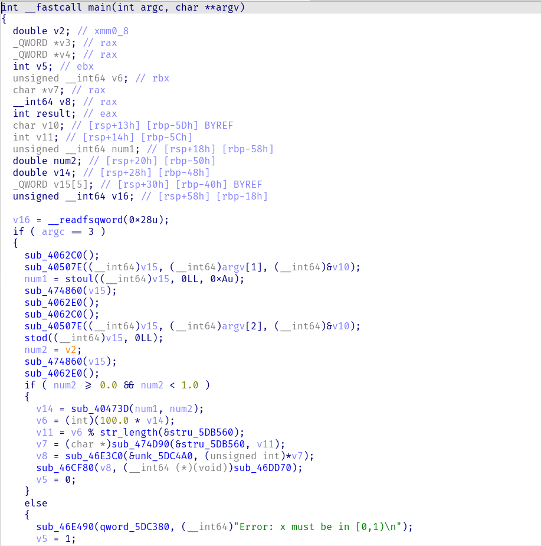
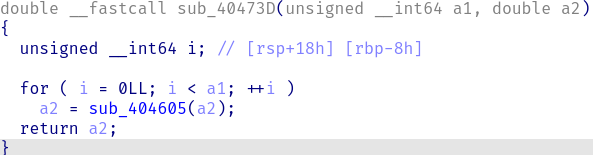
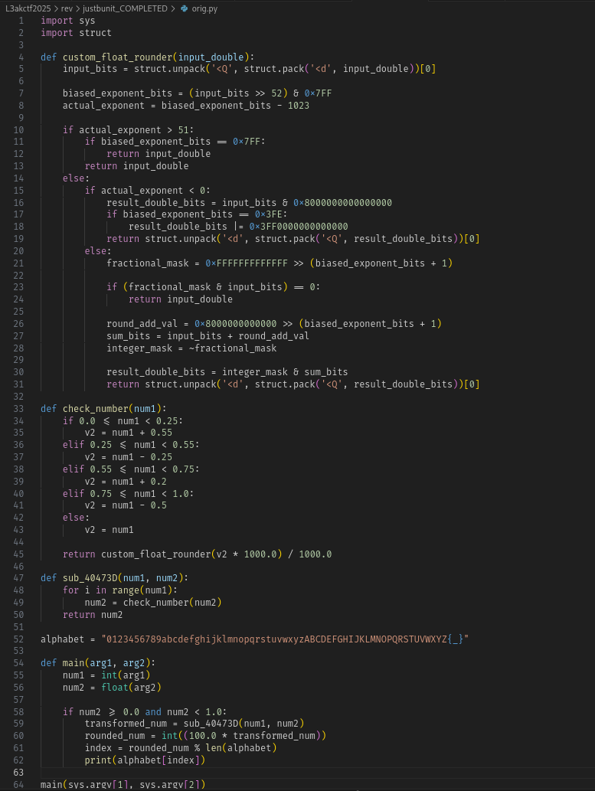
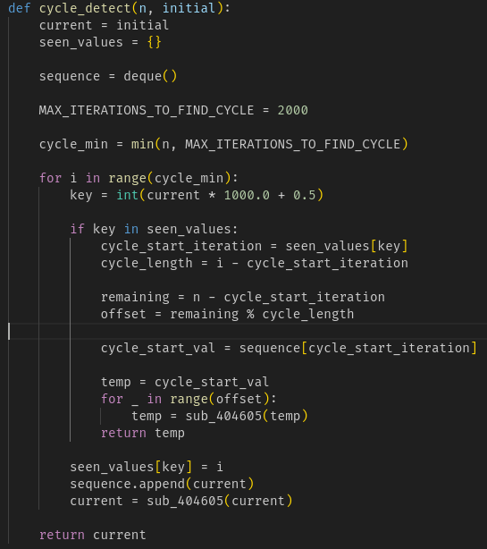

# Just Bun It (Rev, 50 points)

> The Buniverse is in trouble, and only the cleverest bunnies can crack the code! The secret flag is hidden, and you'll need to nibble your way through some tricky numbers to find it. Don't let this challenge carrot away from you—put on your thinking ears and get ready to bun-leash your skills!
>
> Contestants are provided with a mysterious binary named runme and a file called input.txt containing pairs of numbers. This binary takes in two numbers as command-line arguments. For example: ./runme 4843 0.362 This will print a single character (e.g., l).
>
> To find the whole flag, feed each pair of numbers from input.txt to the binary (one pair at a time) and collect all the characters!
>
> Can you out-hop the rest and claim the flag? Good luck, and may your paws be swift and your guesses un-fur-gettable!


FLAG = l3ak{bun_thought_binary_lifting_was_needed_turns_out_f_was_cyclic_after_all}

This challenge was a reverse engineering challenge for the L3AK 2025 CTF.

## Solving
After downloading the binary and opening it in IDA, I noticed it was full of unknown function names, which lead me to believe it was compiled without debug symbols. So I jumped into the start function and then double clicked the first argument of the only called function. (Pro tip that is usually the main function). 



When looking at the main function I noticed a bunch of functions, going through I figured out it was written in c++ so most of the functions I didn't care about. I decided to rename some of the functions and then jumped into the first function in sub_40473D. 



After jumping through a couple more functions I noticed what looked like a custom float rounding function so I copied and pasted that into a text editor and created a simple main method to confirm my suspicions. I then decided to run the binary in GDB and break on address 0x4049A7 which is the first global data that wasn't a structure. Turns out it was just an alphabet that looked like this ```0123456789abcdefghijklmnopqrstuvwxyzABCDEFGHIJKLMNOPQRSTUVWXYZ{_}``` . After I saw that I finally figured out the task was to optimize the code because the binary was slow on the bigger inputs. I decided to first reimplement the decompiled code into python which ended up look like this 


When I ran it against all of the inputs I noticed that it was way too slow and would take way longer than the CTF time limit to finish. I was stuck for a little bit and decided to run original binary with a few different inputs and saw that the same output would display for every power of 2 so I decided to use cycle detection to speed up the process. The code ended up looking like this



I decided to have google gemini create a simple parser for the input file and ran the python script. It immediately spit out the flag ```l3ak{bun_thought_binary_lieting_was_needed_turns_out_f_was_cyclic_after_all}```. I submmited the output but it said it was incorrect so I decided to change the e in lieting to an f and submmited the corrected input and got the points. 